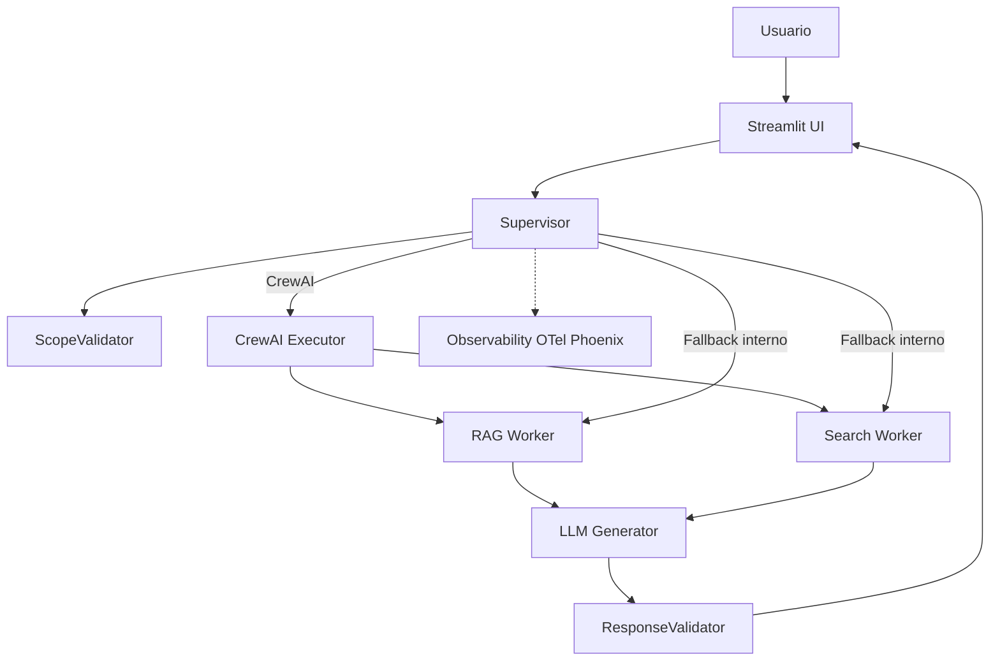

# FIFA World Cup Chatbot ⚽

Assistente multiagente para perguntas sobre Copa do Mundo (história + temas atuais da Copa 2026), com:
- RAG em documento oficial
- busca web via Serper
- resposta estruturada em JSON
- UI Streamlit multilíngue com suporte a voz
- observabilidade com OpenTelemetry/Phoenix


## Objetivo

Responder perguntas sobre Copa do Mundo com boa precisão e fonte explícita (`rag`, `web` ou `hybrid`), usando roteamento inteligente entre workers especializados.

## Arquitetura



Fluxo principal:
1. `Supervisor` valida escopo da pergunta.
2. Decide fonte (RAG, Web ou ambos).
3. `LLMGenerator` consolida resposta.
4. `ResponseValidator` garante estrutura JSON.

Detalhes  em `ARCHITECTURE.md`.

## Funcionalidades

- RAG local com embeddings + FAISS (`data/`).
- Busca web em tempo real com Serper.
- Orquestração por CrewAI com fallback interno automático.
- Resposta estruturada com campos como `answer`, `main_facts`, `related_topics`, `pages`, `links`.
- UI com múltiplos idiomas e entrada/saída por voz.
- Telemetria de spans, métricas e logs.

## Stack

- Python 3.11+
- Streamlit + FastAPI
- OpenAI API
- CrewAI
- FAISS
- Serper API
- OpenTelemetry + Arize Phoenix

## Execução local

### 1) Preparar ambiente

```bash
python3 -m venv .venv
source .venv/bin/activate
pip install -r requirements.txt
```

### 2) Configurar variáveis

```bash
cp .env.example .env
```

Defina no mínimo:

```env
OPENAI_API_KEY=...
SERPER_API_KEY=...  
```

### 3) Rodar a UI

```bash
streamlit run app.py
```

Acesse `http://localhost:8501`.

### 4) Rodar a API 

```bash
uvicorn main:app --reload
```

- Docs: `http://localhost:8000/docs`
- Health: `http://localhost:8000/health`

## RAG

Documento base: `docs/Seminar_DCSD_Foot_20170126.pdf`

Regerar artefatos:

```bash
python scripts/ingest_rag.py
python scripts/build_faiss_index.py
```

Arquivos gerados:
- `data/embeddings.json`
- `data/faiss/index.faiss`
- `data/faiss/metadata.json`

## Observabilidade (Phoenix)

Status para avaliação:
- O projeto de observabilidade no Arize/Phoenix Cloud já está criado
- Os avaliadores foram convidados por e-mail já possuem acesso ao projeto
- As métricas e logs da aplicação podem ser visualizados pelo Arize.

Cloud (opcional):
- `PHOENIX_ENABLED=true`
- `PHOENIX_PROJECT_NAME=...`
- `PHOENIX_COLLECTOR_ENDPOINT=...`
- `OTEL_EXPORTER_OTLP_METRICS_ENDPOINT=...`
- `PHOENIX_API_KEY=...`

Local com Docker:

```bash
bash scripts/phoenix.sh up
```

Acesse `http://localhost:6006`.

## API rápida

### POST `/chat`

Request:

```json
{
  "query": "Quem venceu a Copa de 2002?"
}
```

Response (exemplo):

```json
{
  "ok": true,
  "result": {
    "result": "...",
    "context_source": "rag"
  }
}
```

### POST `/chat/batch`

Request:

```json
{
  "items": [
    { "query": "Quem venceu a Copa de 1994?" },
    { "query": "Quais cidades sediam a Copa 2026?" }
  ]
}
```

## Variáveis de ambiente principais

```env
# LLM
LLM_MODEL=gpt-4.1-nano
LLM_TEMPERATURE=0.3

# RAG
RAG_USE_FAISS=true
RAG_TOP_K=3
CHUNK_SIZE=500
CHUNK_OVERLAP=100

# Busca
SEARCH_TOP_K=3

# CrewAI
USE_CREWAI=true
CREWAI_STORAGE_DIR=.crewai
CREWAI_TRACING_ENABLED=true

# Observabilidade
PHOENIX_ENABLED=true
METRICS_ENABLED=true
LOG_LEVEL=INFO

# Cache e contexto
CACHE_ENABLED=true
CACHE_TTL_SECONDS=300
RAG_CACHE_TTL_SECONDS=300
SEARCH_CACHE_TTL_SECONDS=300
QUERY_REWRITE_ENABLED=true
CONTEXT_TTL=3
```

## Estrutura do projeto

```text
.
├─ app.py
├─ main.py
├─ crew/
├─ scripts/
├─ docs/
├─ data/
├─ front/
├─ docker-compose.yml
├─ Dockerfile
├─ requirements.txt
├─ ARCHITECTURE.md
├─ INSTALL_VOICE.md
├─ TROUBLESHOOTING_VOICE.md
└─ README.md
```

## Troubleshooting rápido

- `SERPER_API_KEY` ausente: Web Search entra em modo simulado.
- FAISS ausente: RAG usa busca linear/híbrida.
- `OPENAI_API_KEY` ausente: geração LLM não funciona corretamente.
- Erros de voz: veja `INSTALL_VOICE.md` e `TROUBLESHOOTING_VOICE.md`.

## Documentação complementar

- Arquitetura detalhada: `ARCHITECTURE.md`
- Instalação de voz: `INSTALL_VOICE.md`
- Solução de problemas de voz: `TROUBLESHOOTING_VOICE.md`

---

